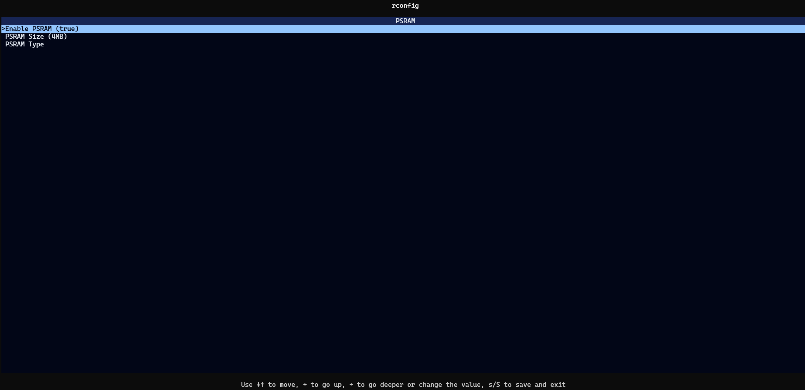

# rconfig

## Known Issues
- almost non-existing error handling
- not everything is validated
- TUI editing is not too good
- code is just prototyping ... I guess it can be cleaned up enough to make it useable in a real project with some effort (or re-implemented from scratch based on this)

## Open Questions

- is it fine to use BTreeMap since it doesn't preserve the order of elements (see https://github.com/serde-rs/serde/issues/269)
- are we fine with the definition format? do we need more flexibility regarding `depends`?
- are we fine with getting values as env-vars?
- probably we want to merge the TUI (as a feature) into `rconfig`?

## Idea

In your crate's `build.rs` you need this
```rust
    rconfig::apply_config(&PathBuf::from("./config/rconfig.toml"));
```

A config-definition can look like this
```toml
# something without a type is just a menu item
[psram]
description = "PSRAM"
depends = [["esp32", "esp32s2", "esp32s3"]]

# something with a type is something which can be configured
[psram.options.enable]
description = "Enable PSRAM"
type = "bool"
default = false

[psram.options.size]
description = "PSRAM Size"
depends = [["psram.enable"]]
type = "enum"
values = [
    { description = "1MB", value = 1 },
    { description = "2MB", value = 2 },
    { description = "4MB", value = 4 },
]
default = 2

[psram.options.type]
description = "PSRAM Type"
depends = [["esp32s3"],["psram.enable"]]

[psram.options.type.options.type]
description = "PSRAM Type"
depends = [["esp32s3"]]
type = "enum"
values = [
    { description = "Quad", value = "quad" },
    { description = "Octal", value = "octal" },
]
default = "quad"

[heap]
description = "Heapsize"

[heap.options.size]
description = "Bytes to allocate"
type = "u32"
min = 0
max = 65536
```

Note an option can depend on features and/or other options.

The values are available as
- `cfg` - e.g. `#[cfg(psram_enable)]`
- `env-var` - e.g `option_env!("CONFIG_psram_size")`

The `config.toml` in the binary crate looks like this
```toml
[fake-hal]
heap.size=30000
psram.enable=true
psram.size=4
psram.type.type="octal"
[fake-wifi]
options.ble=false
```

## TUI

Build `./rconfig-tui` and run it in the example crate's folder (i.e. `example/example`). Probably it shouldn't be it's own crate but contained in the `rconfig` crate.

It will run a build of the binary crate to learn about the used crates supporting `rconfig` and how their config-definitions look like.

`ESC` will exit without saving the changes.
`S` will save and exit the TUI.

Currently support for changing numeric and string values isn't great.



Options

- `--fix`                  Ignore invalid configuration keys
    - still launches the TUI
    - you can save the config and have a valid config after e.g. changing features
- `--force`                Don't ask when removing invalid configuration keys
    - currently just disables the confirmation for `--init`
- `--init`                 Create a new empty `config.toml`
- `--features <FEATURES>`  Features to be passed to the build
- `--no-default-features`  Don't activate default features
